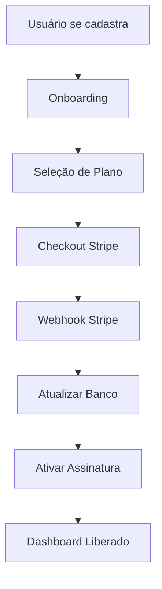

# Análise Completa do Aplicativo ZapAgenda

## 📋 Visão Geral
**ZapAgenda** é um sistema de agendamento digital via WhatsApp para empresas de serviços (salões, barbearias, clínicas, etc.). O aplicativo permite que empresas gerenciem agendamentos, clientes e serviços através de uma interface web moderna.

## 🏗️ Arquitetura Técnica

### Stack Principal
- **Frontend**: React 18 + TypeScript + Vite
- **UI Framework**: Radix UI + Tailwind CSS + shadcn/ui
- **Backend**: Supabase (PostgreSQL + Edge Functions)
- **Autenticação**: Supabase Auth
- **Pagamentos**: Stripe (configurado mas não funcional)
- **Roteamento**: React Router DOM v6
- **Estado**: React Query + Context API
- **Formulários**: React Hook Form + Zod

### Estrutura de Pastas
```
src/
├── components/          # Componentes reutilizáveis
│   ├── ui/             # Componentes base (shadcn/ui)
│   ├── dashboard/      # Componentes do dashboard
│   ├── appointments/   # Componentes de agendamento
│   └── ...
├── hooks/              # Custom hooks
├── pages/              # Páginas da aplicação
├── services/           # Serviços de API
├── utils/              # Utilitários
└── types/              # Definições de tipos
```

## 🗄️ Estrutura do Banco de Dados

### Tabelas Principais
1. **profiles** - Dados das empresas
2. **appointments** - Agendamentos
3. **clients** - Clientes das empresas
4. **services** - Serviços oferecidos
5. **company_settings** - Configurações da empresa
6. **professionals** - Profissionais da empresa
7. **daily_schedules** - Horários de funcionamento
8. **public_theme_settings** - Temas da página pública

### ⚠️ Tabela Ausente
- **subscribers** - Tabela para controle de assinaturas (NÃO EXISTE)

## 🔐 Sistema de Autenticação e Autorização

### Fluxo Atual
1. **Login/Signup** → Supabase Auth
2. **Onboarding** → Configuração da empresa
3. **Checkout** → Pagamento (simulado)
4. **Dashboard** → Aplicação principal

### Guards Implementados
- **ProtectedRoute** - Proteção baseada em requisitos
- **AuthGuard** - Redirecionamento de usuários logados
- **RootRedirect** - Roteamento inteligente

## 💳 Sistema de Pagamentos (CRÍTICO)

### Estado Atual: QUEBRADO
- **Problema**: Tabela `subscribers` não existe
- **Funções Edge**: Configuradas mas falhando
- **Stripe**: Integrado mas não funcional
- **Solução Temporária**: Simulação de assinatura ativa

### Configuração Stripe
- **Price ID**: `price_1RuPSSAGs1NuWqcoIbRfCPzV`
- **Plano**: Premium - R$ 29,90/mês
- **Webhook**: Configurado mas sem tabela de destino

## 🚀 Funcionalidades Implementadas

### ✅ Funcionais
1. **Autenticação completa**
2. **Gestão de perfil da empresa**
3. **CRUD de clientes**
4. **CRUD de serviços**
5. **CRUD de agendamentos**
6. **Agenda mensal**
7. **Página pública de agendamento**
8. **Personalização de temas**
9. **Configurações de horário**
10. **Relatórios básicos**
11. **Sistema de notificações**

### ❌ Não Funcionais
1. **Sistema de pagamentos**
2. **Controle de assinaturas**
3. **Limites por plano**
4. **Webhooks do Stripe**

## 🔧 Preparação para Pagamento Recorrente

### 1. Estrutura de Banco Necessária

```sql
-- Tabela de assinantes
CREATE TABLE public.subscribers (
  id UUID DEFAULT gen_random_uuid() PRIMARY KEY,
  user_id UUID REFERENCES auth.users(id) ON DELETE CASCADE,
  email TEXT NOT NULL UNIQUE,
  stripe_customer_id TEXT,
  subscribed BOOLEAN DEFAULT false,
  subscription_tier TEXT,
  subscription_end TIMESTAMP WITH TIME ZONE,
  created_at TIMESTAMP WITH TIME ZONE DEFAULT NOW(),
  updated_at TIMESTAMP WITH TIME ZONE DEFAULT NOW()
);

-- Tabela de planos
CREATE TABLE public.subscription_plans (
  id UUID DEFAULT gen_random_uuid() PRIMARY KEY,
  name TEXT NOT NULL,
  stripe_price_id TEXT NOT NULL UNIQUE,
  price_monthly DECIMAL(10,2) NOT NULL,
  features JSONB,
  limits JSONB,
  active BOOLEAN DEFAULT true,
  created_at TIMESTAMP WITH TIME ZONE DEFAULT NOW()
);

-- Tabela de transações
CREATE TABLE public.payment_transactions (
  id UUID DEFAULT gen_random_uuid() PRIMARY KEY,
  user_id UUID REFERENCES auth.users(id),
  stripe_payment_intent_id TEXT,
  amount DECIMAL(10,2),
  currency TEXT DEFAULT 'BRL',
  status TEXT,
  created_at TIMESTAMP WITH TIME ZONE DEFAULT NOW()
);
```

### 2. Variáveis de Ambiente Necessárias

```env
# Stripe
STRIPE_SECRET_KEY=sk_live_...
STRIPE_PUBLISHABLE_KEY=pk_live_...
STRIPE_WEBHOOK_SECRET=whsec_...

# Supabase
SUPABASE_URL=https://...
SUPABASE_ANON_KEY=eyJ...
SUPABASE_SERVICE_ROLE_KEY=eyJ...
```

### 3. Hooks e Serviços a Atualizar

#### useSubscription.ts
```typescript
// Remover simulação e implementar verificação real
const checkSubscription = async () => {
  const { data, error } = await supabase.functions.invoke('check-subscription');
  // Lógica real de verificação
};
```

#### Novos Hooks Necessários
- **usePayment** - Gestão de pagamentos
- **usePlans** - Gestão de planos
- **useUsageLimit** - Controle de limites

### 4. Componentes a Criar

#### PaymentMethod.tsx
```typescript
// Componente para gerenciar métodos de pagamento
// Integração com Stripe Elements
```

#### PlanSelector.tsx
```typescript
// Seletor de planos de assinatura
// Comparação de features
```

#### UsageIndicator.tsx
```typescript
// Indicador de uso vs limites do plano
// Alertas de limite próximo
```

### 5. Edge Functions a Corrigir

#### check-subscription/index.ts
- Corrigir referência à tabela `subscribers`
- Implementar cache de verificação
- Adicionar logs detalhados

#### create-checkout/index.ts
- Suporte a múltiplos planos
- Metadata completa
- Tratamento de erros melhorado

#### stripe-webhook/index.ts
- Processar todos os eventos relevantes
- Atualizar tabela `subscribers`
- Notificações por email

### 6. Fluxo de Pagamento Recomendado



### 7. Controle de Limites por Plano

#### Plano Básico (Gratuito)
- 10 agendamentos/mês
- 1 profissional
- Sem personalização

#### Plano Premium (R$ 29,90/mês)
- Agendamentos ilimitados
- Profissionais ilimitados
- Personalização completa
- Relatórios avançados

### 8. Monitoramento e Analytics

#### Métricas Importantes
- Taxa de conversão (trial → paid)
- Churn rate mensal
- LTV (Lifetime Value)
- MRR (Monthly Recurring Revenue)

#### Ferramentas Sugeridas
- Stripe Dashboard para métricas de pagamento
- Supabase Analytics para uso da aplicação
- Custom dashboard para KPIs do negócio

## 🚨 Problemas Críticos Identificados

### 1. Sistema de Pagamento Quebrado
- **Impacto**: Alto - Impossível monetizar
- **Urgência**: Crítica
- **Solução**: Criar tabela subscribers + corrigir Edge Functions

### 2. Falta de Controle de Limites
- **Impacto**: Médio - Todos os usuários têm acesso completo
- **Urgência**: Alta
- **Solução**: Implementar middleware de verificação de limites

### 3. Ausência de Planos Diferenciados
- **Impacto**: Alto - Sem estratégia de pricing
- **Urgência**: Alta
- **Solução**: Criar sistema de planos flexível

### 4. Webhooks Não Funcionais
- **Impacto**: Alto - Assinaturas não são atualizadas
- **Urgência**: Crítica
- **Solução**: Corrigir webhook + criar tabela subscribers

## 📈 Roadmap de Implementação

### Fase 1: Correção Crítica (1-2 semanas)
1. Criar tabela `subscribers`
2. Corrigir Edge Functions
3. Testar fluxo de pagamento end-to-end
4. Implementar webhook funcional

### Fase 2: Controle de Limites (1 semana)
1. Criar middleware de verificação
2. Implementar limites por plano
3. Adicionar indicadores de uso
4. Alertas de limite

### Fase 3: Melhorias (2-3 semanas)
1. Dashboard de admin
2. Métricas de negócio
3. Sistema de cupons
4. Planos anuais com desconto

### Fase 4: Otimizações (ongoing)
1. A/B testing de pricing
2. Onboarding otimizado
3. Retenção de usuários
4. Upselling automático

## 🔍 Recomendações Específicas

### Para Integração de Pagamento Recorrente

1. **Use Stripe Billing Portal**
   - Permite que usuários gerenciem suas próprias assinaturas
   - Reduz suporte manual

2. **Implemente Dunning Management**
   - Retry automático para pagamentos falhados
   - Emails de cobrança automáticos

3. **Adicione Proration**
   - Upgrades/downgrades proporcionais
   - Créditos automáticos

4. **Configure Webhooks Robustos**
   - Retry logic para falhas
   - Idempotência para evitar duplicatas

5. **Monitore Métricas Chave**
   - Failed payments
   - Subscription lifecycle
   - Revenue recognition

## 💡 Oportunidades de Melhoria

1. **Multi-tenancy Real**: Isolamento completo por empresa
2. **API Pública**: Para integrações externas
3. **Mobile App**: React Native ou PWA melhorada
4. **WhatsApp Integration**: Bot para agendamentos
5. **AI Features**: Sugestão de horários, análise de padrões

## 🎯 Conclusão

O ZapAgenda é um aplicativo bem estruturado com funcionalidades sólidas, mas com um sistema de pagamentos completamente quebrado. A prioridade máxima deve ser corrigir o sistema de assinaturas para viabilizar a monetização. Com as correções sugeridas, o aplicativo estará pronto para escalar e gerar receita recorrente.